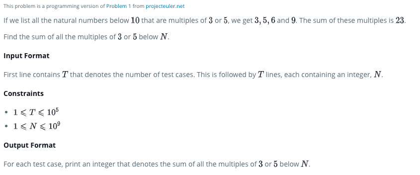

## Project Euler #1: Multiples of 3 and 5

# Problem

## Test cases

### Approach for solving Problem

- Take the elements up to 30
  

- here we can see multiples of 3 and 5 sa:
  

- Summation can be
  

- **But there are repeatations of multiplications of 3*5 in both**
- we need to remove them once
- Find intersection between two sets
  

- they are multiplications of 15
- By removing them total sum becomes
  
  
